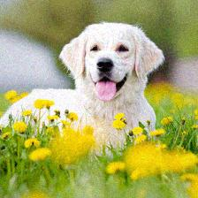

## Adversarial example generator

This script generates adversarial examples for convolutional neural networks
by minimizing the correct classification label of dog.jpthe original image. Adversarial
examples are trained with multiple versions of the same image with added Gaussian
noise.


### Dependency

This script requires trained [OverFeat](https://github.com/sermanet/OverFeat) network 
or VGG19 network. Also requires torch and CUDA.


### Example

The example script predicts the output category of original and its adversarial examples.
It first generates 10 copies of an input image. Each copies is added a small amount of 
Gaussian Noise. The network then finds a noise, theta, that when added to these images,
minimizes the actual classification of the image.

The script then generates another batch of images with small amount of Gaussian Noise
in them and then add theta to them. We want to test if this theta which was trained
on the Gaussian added images will work on a new batch of Gaussian added images.
```bash
th example.lua
```



